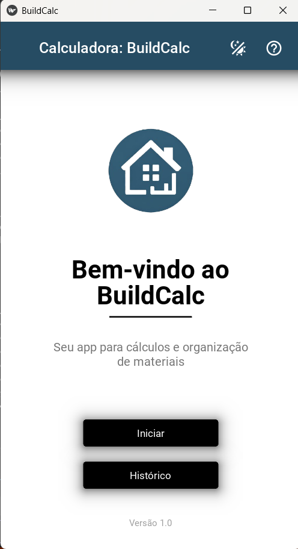
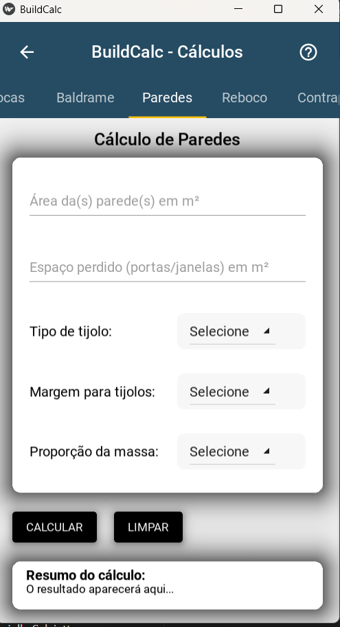
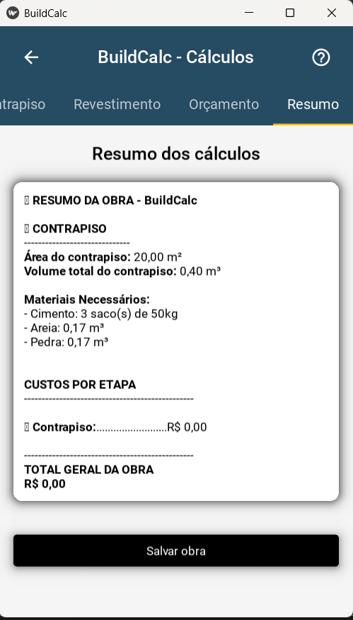
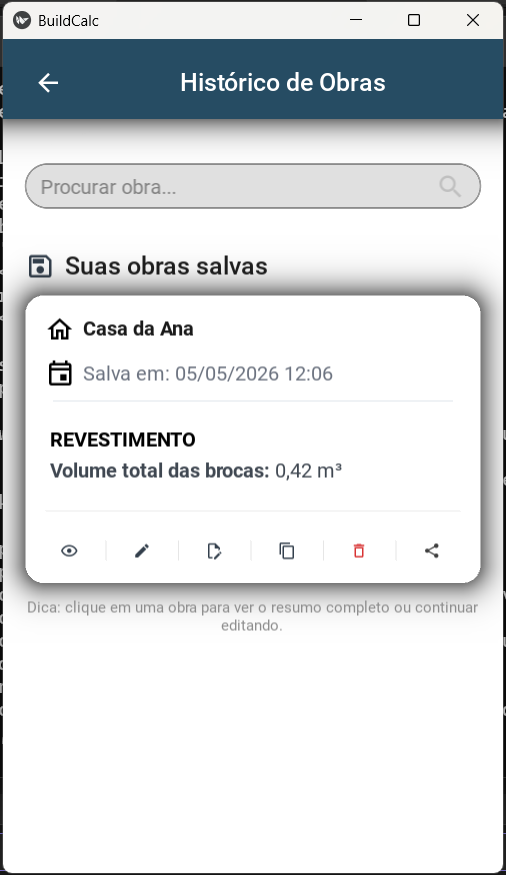

# 🧱 BuildCalc

Sistema completo para cálculo de materiais de construção, com histórico de obras e geração de PDF.

---

## 🚀 Funcionalidades

- 🔩 Cálculo de Brocas
- 🧱 Cálculo de Baldrame
- 🏗️ Cálculo de Paredes
- 🪨 Cálculo de Reboco
- ⬛ Cálculo de Contrapiso
- 🧩 Cálculo de Revestimento (Piso/Azulejo)
- 💰 Orçamento automático com base nos materiais
- 📄 Exportação de PDF das obras
- 🗂️ Histórico de obras salvas
- 🔍 Filtro de busca no histórico
- ✏️ Edição, exclusão e duplicação de obras

---

## 🛠️ Tecnologias utilizadas

- Python
- Kivy
- KivyMD
- JSON (armazenamento local)

---

## 📸 Interface

Interface moderna com abas organizadas por tipo de cálculo:

- Navegação por abas
- Tema escuro
- Feedback visual
- Layout responsivo

### 🏠 Tela Inicial

### 🧮 Tela de Cálculo

### 📊 Resultado

### 📂 Histórico

---

## 💡 Como usar

1. Clique em **Iniciar**
2. Preencha os dados em cada aba
3. Clique em **Calcular**
4. Visualize o resumo
5. Salve a obra no histórico
6. Gere PDF, edite ou compartilhe

---

## 📁 Estrutura do projeto

Calculadora/
├── Calculadora.py
├── data/
│ └── obras.json
├── assets/
│ └── imagens

---

## 📌 Observações

- Os dados são salvos localmente em JSON
- Não requer conexão com internet
- Projeto focado em aprendizado e prática de desenvolvimento

---

## 👩‍💻 Autora

Gabriela Salviatto

---

## 📄 Licença

Este projeto é de uso livre para fins de estudo.
